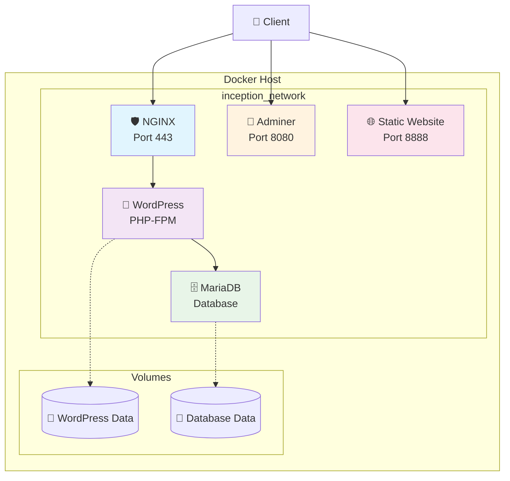
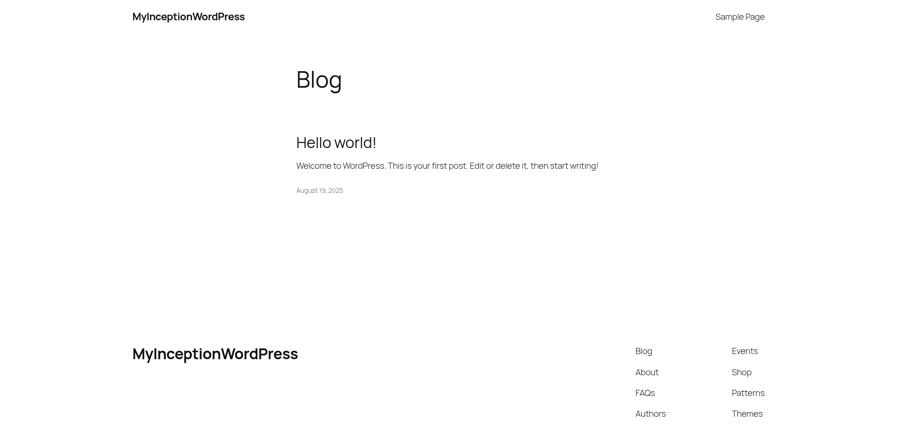
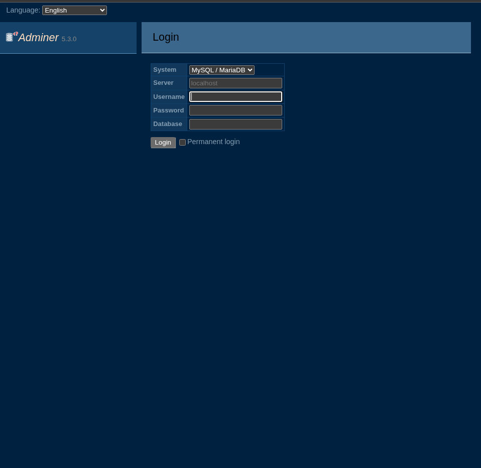
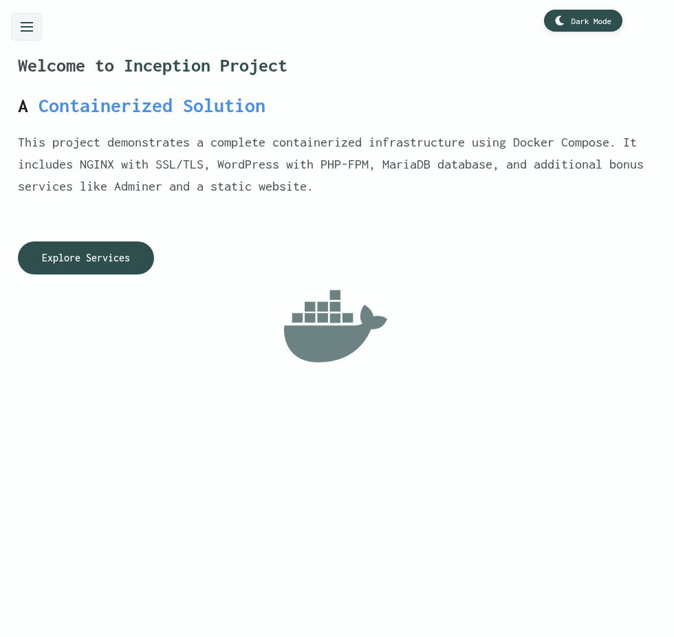
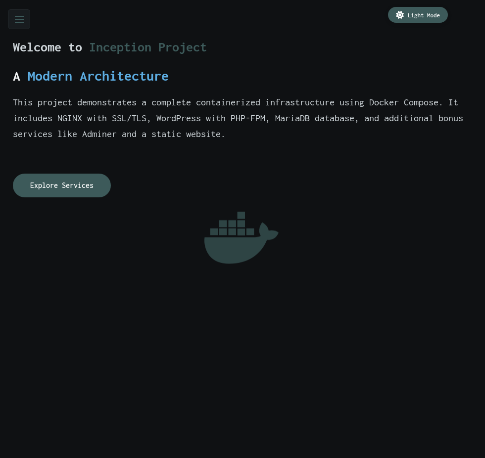

# 🐳 Inception - Docker Infrastructure Project

<div align="center">

[](https://42.fr/)
[](https://www.docker.com/)
[](https://nginx.org/)
[](https://wordpress.org/)
[](https://mariadb.org/)

*A complete containerized infrastructure demonstrating modern DevOps practices*

[🚀 Live Demo](https://abouguri.42.fr) • [📖 Documentation](#-documentation) • [🎯 Features](#-features)

</div>

---

## 📋 Table of Contents

- [🎯 Project Overview](#-project-overview)
- [✨ Features](#-features)
- [🏗️ Architecture](#️-architecture)
- [🚀 Quick Start](#-quick-start)
- [📦 Services](#-services)
- [🎨 Bonus Features](#-bonus-features)
- [🔧 Configuration](#-configuration)
- [📸 Screenshots](#-screenshots)
- [🛠️ Development](#️-development)
- [📝 Documentation](#-documentation)
- [🤝 Contributing](#-contributing)

---

## 🎯 Project Overview

**Inception** is a comprehensive Docker infrastructure project that demonstrates the creation of a multi-service containerized environment. This project showcases modern DevOps practices by orchestrating multiple services using Docker Compose, implementing SSL/TLS encryption, and providing a complete web application stack.

### 🎓 Academic Context
This project is part of the **42 School curriculum**, focusing on:
- Containerization with Docker
- Service orchestration with Docker Compose
- Network security and SSL/TLS
- Database management and persistence
- Web server configuration
- System administration

---

## ✨ Features

### 🔐 **Security First**
- ✅ SSL/TLS encryption with custom certificates
- ✅ Secure inter-service communication
- ✅ Isolated container environments
- ✅ No plaintext credentials in configuration files

### 🏗️ **Infrastructure**
- ✅ Custom Docker images built from Debian Bullseye
- ✅ Docker Compose orchestration
- ✅ Persistent data volumes
- ✅ Custom bridge network
- ✅ Health checks for critical services

### 🌐 **Web Services**
- ✅ NGINX reverse proxy with SSL termination
- ✅ WordPress CMS with PHP-FPM
- ✅ MariaDB database with replication support
- ✅ Adminer database management interface
- ✅ Custom static website portfolio

### 📱 **Modern UX**
- ✅ Responsive design for all screen sizes
- ✅ Dark/Light theme toggle with persistence
- ✅ Mobile-friendly navigation
- ✅ Smooth animations and transitions

---

## 🏗️ Architecture



### 🔗 **Service Communication**
- **Client** → **NGINX** (HTTPS:443)
- **NGINX** → **WordPress** (Internal network)
- **WordPress** → **MariaDB** (Internal network)
- **Client** → **Adminer** (HTTP:8080)
- **Client** → **Static Website** (HTTP:8888)

---

## 🚀 Quick Start

### 📋 Prerequisites
- Docker Engine (>= 20.10)
- Docker Compose (>= 2.0)
- Make utility
- Git

### ⚡ Installation

1. **Clone the repository**
   ```bash
   git clone git@github.com:abouguri/Inception.git
   cd Inception
   ```

2. **Configure environment**
   ```bash
   # Edit the environment file
   cp srcs/.env.example srcs/.env
   vim srcs/.env
   ```

3. **Build and launch**
   ```bash
   # Build and start all services
   make

   # Or step by step
   make build
   make up
   ```

4. **Access the services**
   - **WordPress Site**: https://abouguri.42.fr
   - **Database Admin**: http://abouguri.42.fr:8080
   - **Portfolio**: http://abouguri.42.fr:8888

### 🛑 Management Commands

```bash
# Stop all services
make down

# View logs
make logs

# Clean everything
make clean

# Rebuild and restart
make re
```

---

## 📦 Services

### 🛡️ NGINX - Reverse Proxy
- **Base Image**: `debian:bullseye`
- **Purpose**: SSL termination, reverse proxy, load balancing
- **Features**:
  - TLS v1.2/v1.3 support
  - Security headers (HSTS, CSP, etc.)
  - Gzip compression
  - Static asset caching

### 📝 WordPress - CMS
- **Base Image**: `debian:bullseye`
- **Purpose**: Content Management System
- **Features**:
  - PHP-FPM 8.1
  - WordPress CLI (wp-cli)
  - Custom themes support
  - Multi-user setup
  - Redis caching ready

### 🗄️ MariaDB - Database
- **Base Image**: `debian:bullseye`
- **Purpose**: MySQL-compatible database
- **Features**:
  - Optimized configuration
  - Persistent storage
  - Automated backups
  - User management
  - SSL connections

---

## 🎨 Bonus Features

### 🔧 Adminer - Database Management
- **Access**: http://abouguri.42.fr:8080
- **Features**:
  - Web-based database administration
  - SQL query editor
  - Database export/import
  - User-friendly interface

### 🌐 Static Website - Project Portfolio
- **Access**: http://abouguri.42.fr:8888
- **Features**:
  - 🌓 **Dark/Light Theme Toggle** with localStorage persistence
  - 📱 **Responsive Design** with mobile navigation
  - ✨ **Modern UI/UX** with smooth animations
  - 🎯 **Service Overview** with direct access links
  - 📊 **Architecture Documentation**

#### 🎨 Portfolio Features
- **Theme Switcher**: Toggle between light and dark modes
- **Mobile Navigation**: Collapsible hamburger menu
- **Service Links**: Direct access to all project services
- **Responsive Layout**: Optimized for all screen sizes
- **Performance**: Optimized assets and lazy loading

---

## 🔧 Configuration

### 📁 Directory Structure
```
Inception/
├── Makefile                 # Build automation
├── srcs/
│   ├── .env                 # Environment variables
│   ├── docker-compose.yml   # Service orchestration
│   └── requirements/
│       ├── nginx/           # NGINX configuration
│       ├── wordpress/       # WordPress setup
│       ├── mariadb/         # Database configuration
│       └── bonus/
│           ├── adminer/     # Database admin
│           └── website/     # Static portfolio
└── README.md
```

### 🔐 Environment Variables

```bash
# Database Configuration
MYSQL_ROOT_PASSWORD=your_secure_password
MYSQL_DATABASE=wordpress
MYSQL_USER=wp_user
MYSQL_PASSWORD=wp_password

# WordPress Configuration
WP_TITLE="Your Site Title"
WP_ADMIN_USER=admin_user
WP_ADMIN_PASSWORD=admin_password
WP_ADMIN_EMAIL=admin@domain.com

# Domain Configuration
DOMAIN_NAME=your-domain.42.fr
```

### 🌐 SSL/TLS Configuration

The project uses self-signed certificates for development. For production:

1. Replace certificates in `srcs/requirements/nginx/tools/`
2. Update NGINX configuration
3. Configure DNS records

---

## 📸 Screenshots

<details>
<summary>🖼️ Click to view screenshots</summary>

### 🌐 WordPress Homepage


### 🔧 Adminer Interface


### 🎨 Portfolio Website - Light Mode


### 🌙 Portfolio Website - Dark Mode


</details>

---

## 🛠️ Development

### 🔍 Debugging

```bash
# Check container status
docker compose ps

# View logs
docker compose logs -f [service_name]

# Execute commands in containers
docker compose exec nginx bash
docker compose exec wordpress bash
docker compose exec mariadb mysql -u root -p
```

### 🧪 Testing

```bash
# Test SSL configuration
curl -k https://abouguri.42.fr

# Test database connection
docker compose exec mariadb mysql -u root -p -e "SHOW DATABASES;"

# Test WordPress installation
curl -I https://abouguri.42.fr
```

### 🔧 Customization

1. **NGINX Configuration**: Edit `srcs/requirements/nginx/conf/nginx.conf`
2. **WordPress Settings**: Modify `srcs/requirements/wordpress/tools/wp-setup.sh`
3. **Database Settings**: Update `srcs/requirements/mariadb/conf/50-server.cnf`

---

## 📝 Documentation

### 📚 Additional Resources

- [Docker Compose Documentation](https://docs.docker.com/compose/)
- [NGINX Configuration Guide](https://nginx.org/en/docs/)
- [WordPress Developer Resources](https://developer.wordpress.org/)
- [MariaDB Knowledge Base](https://mariadb.com/kb/en/)

### 🎯 42 School Requirements

This project fulfills all mandatory requirements:
- ✅ Custom Dockerfiles for each service
- ✅ Docker Compose orchestration
- ✅ Custom network configuration
- ✅ Volume persistence
- ✅ SSL/TLS encryption
- ✅ No latest tags or pre-built images
- ✅ Proper error handling
- ✅ Security best practices

Plus bonus features:
- ✅ Adminer database management
- ✅ Custom static website with modern features
- ✅ Additional services demonstration

---

## 🤝 Contributing

### 🐛 Issues
Found a bug? Please open an issue with:
- Detailed description
- Steps to reproduce
- Expected vs actual behavior
- Environment information

### 💡 Suggestions
Have ideas for improvements? 
- Open a feature request
- Describe the enhancement
- Explain the use case

### 🔧 Development Setup
1. Fork the repository
2. Create a feature branch
3. Make your changes
4. Test thoroughly
5. Submit a pull request

---

## 📄 License

This project is part of the 42 School curriculum and is intended for educational purposes.

---

## 👨‍💻 Author

**abouguri** - 42 School Student

- GitHub: [@abouguri](https://github.com/abouguri)
- 42 Profile: [abouguri](https://profile.intra.42.fr/users/abouguri)

---

<div align="center">

### 🌟 Star this repository if it helped you! 

*Made with ❤️ at 42 School*

</div>
